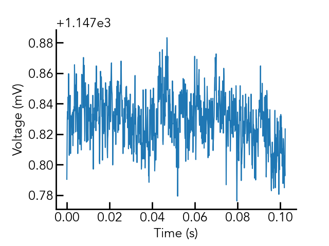
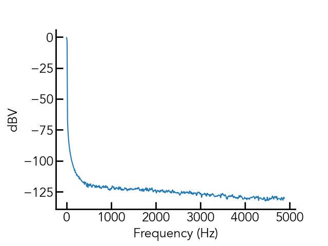
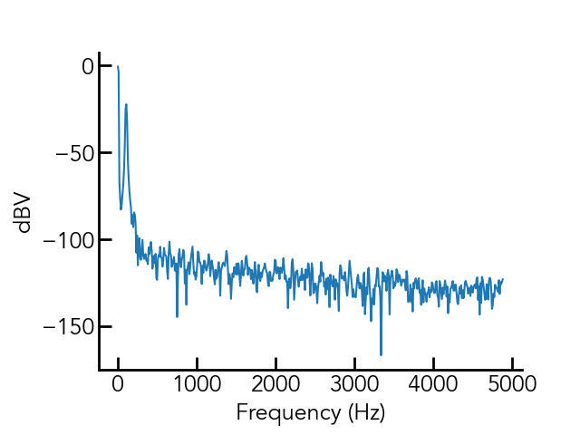
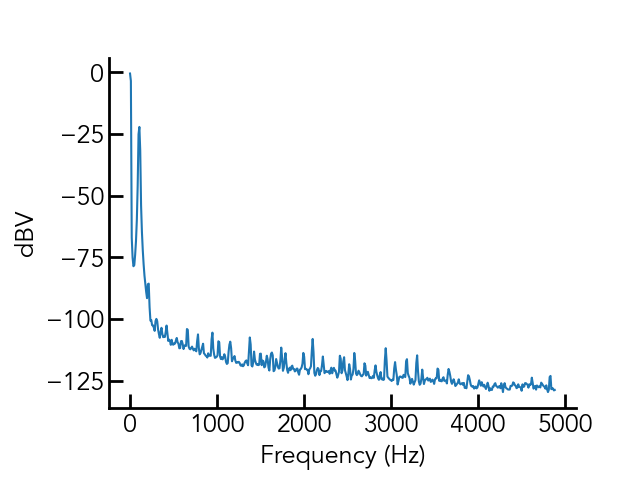
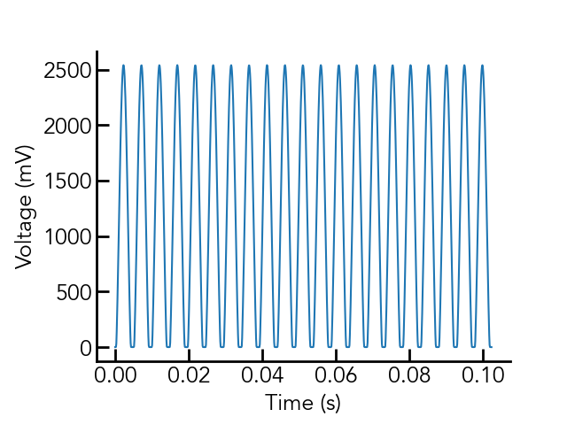
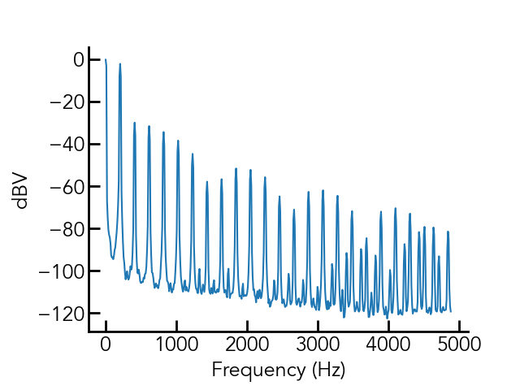

# MCP3561 Development Board
Development board for MCP3561 ADC, a <153kSpS
sigma-delta (oversampling) ADC capable of ~108dB SNR.

## Features
- 3.3V on-board reference
- low-noise 3.3V digital and analog supplies
- Powered via single 4V-12V input voltage
- Sampling rate tested up to 10kHz
- BNC input synchronization
- Single-channel SMA analog input
- Based on the Teensy 4.1, micro-USB communication to PC
- Additional digital/analog outputs (used here for motor control)

## Performance Data
Measured with MCLK=10MHz, OSR=256, fs=9.76kHz, Av=1
- Rms voltage noise 9.8uV, PSD=143nV/rtHz, 0.2kHz to fs/2

Measured with MCLK=10MHz, OSR=256, fs=9.76kHz, Av=10
- Rms voltage noise is 13.4uV, PSD=195nV/rtHz, 0.2kHz to fs/2

Fig. 1 and 2 show the time-domain and frequency-domain representation of 0.1s
of measured signal with the input to the board grounded.

Fig. 3 and 4 show the same plots with an input signal of 10mVrms (Av=10) at
105Hz.

Fig. 3 and 4 show the same plots with an input signal of 100mVrms (Av=10) at
205Hz. 

## Getting Started
Using this dev board requires you have python installed on your computer, as
well as the Teensyduino IDE. You must then upload the code in ``arduino_code/``
to the Teensy being used for measurement, which I have written to communicate
via the arduino ``Serial()`` interface (USB) using the SCPI language. Feel free
to communicate with it using your own scripts, but I have written a python
implementation which can be found in ``MCP3561.py``
[here](https://github.com/edmundsj/AD7766_Python.git).

## Issues
### Issues in version 1
- [FIXED v2] U3 (TLV opamp) package is incorrect - TSOT353, actual package is SOT23-5.
- 1/f noise of TLV opamp is appreciable when configured for a gain of 10. 

